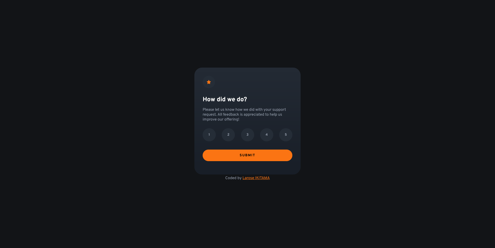

# Frontend Mentor - Interactive rating component solution

This is a solution to the [Interactive rating component challenge on Frontend Mentor](https://www.frontendmentor.io/challenges/interactive-rating-component-koxpeBUmI). Frontend Mentor challenges help you improve your coding skills by building realistic projects. 

## Table of contents

- [Overview](#overview)
  - [The challenge](#the-challenge)
  - [Screenshot](#screenshot)
  - [Links](#links)
- [My process](#my-process)
  - [Built with](#built-with)
  - [What I learned](#what-i-learned)
- [Author](#author)


## Overview

### The challenge

Users should be able to:

- View the optimal layout for the app depending on their device's screen size
- See hover states for all interactive elements on the page
- Select and submit a number rating
- See the "Thank you" card state after submitting a rating

### Screenshot



### Links

- Solution URL: [See repository](https://github.com/ikitamalarose/interactive-rating-component-challenge.git)
- Live Site URL: [Preview website](https://interactive-rating-component-challenge-delta.vercel.app/)

## My process

### Built with

- Semantic HTML5 markup
- CSS custom properties
- Flexbox
- CSS Grid
- JavaScript

### What I learned

```css
background: linear-gradient(to bottom, #232a34 0%, #181e27 100%);
```
- I explored the use of CSS gradients to create visually appealing backgrounds. This specific linear gradient creates a smooth transition from a dark blue-gray color (#232a34) at the top to a slightly darker shade (#181e27) at the bottom. Gradients are a great way to add depth and professionalism to a design without the need for multiple images or extra assets.

## Author

- Frontend Mentor - [@ikitamalarose](https://www.frontendmentor.io/profile/ikitamalarose)
- GitHub - [@ikitamalarose](https://github.com/ikitamalarose)
- Email - [laroseikitama@gmail.com](mailto:laroseikitama@gmail.com)
